# Campaign Factory Flow Diagram

This document contains the complete mermaid diagram visualizing the end-to-end campaign factory pipeline from intel inputs to launched, optimized campaigns.

## How to View the Diagram

### In VS Code:
1. **Install the extension:** Install "Markdown Preview Mermaid Support" by Matt Bierner from the VS Code marketplace
2. **Open preview:** Press `Cmd+Shift+V` (Mac) or `Ctrl+Shift+V` (Windows/Linux) to open the Markdown preview
3. **Or right-click:** Right-click in the editor and select "Open Preview" or "Open Preview to the Side"

### If the diagram still doesn't render:
- Make sure you're viewing the **preview** (not the raw markdown source)
- Try restarting VS Code after installing the extension
- Check that the extension is enabled (Extensions panel → search "mermaid" → ensure it's enabled)
- Try viewing online at [mermaid.live](https://mermaid.live) - copy the mermaid code block content

### Text Color Customization:
If text is still hard to read, you can adjust the `color` values in the `classDef` statements:
- Current: `color:#000000` (black text on light backgrounds)
- For darker backgrounds, use: `color:#FFFFFF` (white text)
- You can also adjust VS Code's mermaid theme in settings: `markdown-mermaid.darkModeTheme` or `markdown-mermaid.lightModeTheme`

### Alternative Viewing:
- **GitHub/GitLab:** The diagram will render automatically when viewing the file on GitHub/GitLab
- **Online Editor:** Copy the mermaid code block to [mermaid.live](https://mermaid.live) for online viewing

### Exporting to PDF:

#### Option 1: Mermaid Live Editor (Easiest - Recommended)
1. Go to [mermaid.live](https://mermaid.live)
2. Copy the entire mermaid code block (lines 30-143 from this file)
3. Paste into the editor
4. Click the **"Actions"** menu → **"Download PNG"** or **"Download SVG"**
5. For PDF: Download SVG, then convert using any online SVG-to-PDF converter or use browser print (File → Print → Save as PDF)

#### Option 2: VS Code Markdown PDF Extension
1. Install "Markdown PDF" extension by yzane
2. Open this markdown file in VS Code
3. Right-click → **"Markdown PDF: Export (pdf)"**
4. The diagram will be rendered in the PDF

#### Option 3: Browser Print (Quick)
1. View the file on GitHub (push to repo and view online)
2. Or use VS Code preview (Cmd+Shift+V)
3. Right-click the rendered diagram → **"Inspect"** to open DevTools
4. Right-click the SVG/canvas element → **"Capture node screenshot"**
5. Or use browser Print (Cmd/Ctrl+P) → Save as PDF (may need to adjust settings)

#### Option 4: Command Line (For Developers)
```bash
# Install mermaid-cli globally
npm install -g @mermaid-js/mermaid-cli

# Export diagram to PDF
mmdc -i docs/prd/campaign-factory-flow-diagram.md -o campaign-factory-diagram.pdf -b transparent
```

#### Option 5: Copy Diagram Code for Sharing
The mermaid code block is self-contained (lines 30-143). You can:
- Share the code block directly
- Paste into any mermaid-compatible tool
- Include in presentations that support mermaid rendering

## Complete Factory Flow

```mermaid
flowchart TD
    %% Input Sources
    S1[System 1 CSV Export] --> S1Intake[System 1 Intake Script]
    FB[Meta Ad Library API] --> FBDiscovery[Facebook Discovery Service]
    
    %% Opportunity Identification
    S1Intake --> S1Norm[Normalize & Cluster]
    S1Norm --> S1API[System 1 API<br/>/campaign/pack]
    FBDiscovery --> FBScore[Score by Signals<br/>versions, duration, platforms]
    
    S1API --> OppEngine[Opportunity Engine]
    FBScore --> OppEngine
    OppEngine --> OppScore[Score & Rank Opportunities]
    OppScore --> OppQueue[Opportunity Queue<br/>status: pending]
    
    %% Blueprint Generation
    OppQueue --> BlueprintGen[Blueprint Generator]
    BlueprintGen --> BudgetCalc[Calculate Budget Allocation<br/>ASC 33%, LAL 17%, etc.]
    BudgetCalc --> TargetPlan[Set Targeting Plan<br/>geo, audiences, LAL %]
    TargetPlan --> CreativeReq[Define Creative Requirements<br/>hooks, formats, LPIDs]
    CreativeReq --> KPISet[Set KPI Targets<br/>ROAS ≥1.30, EMQ ≥5]
    KPISet --> BlueprintDB[(Campaign Blueprints<br/>status: draft)]
    
    %% Human Review
    BlueprintDB --> HumanReview{Human Review<br/>Dan/Maryna}
    HumanReview -->|Reject| OppQueue
    HumanReview -->|Approve| BlueprintApproved[Blueprint Approved<br/>status: approved]
    
    %% Creative Pipeline
    BlueprintApproved --> LPIDQuery[Query Article Factory<br/>Get LPIDs by Angle]
    LPIDQuery --> LPIDSelect[Select LPIDs<br/>≥3k sessions, vRPS ≥ median]
    
    LPIDSelect --> HookGen[Hook Ideation Agent]
    OppQueue -.->|System 1 keywords| HookGen
    OppQueue -.->|Facebook ad samples| HookGen
    
    HookGen --> HookIdeation[Generate Hooks<br/>Ideation or Clone Mode]
    HookIdeation --> HookScore[Score Hooks<br/>keyword alignment, uniqueness]
    HookScore --> HookSelect[Select Top Hooks<br/>6-8 ASC, 3-5 LAL]
    HookSelect --> HookDB[(Hook Concepts<br/>status: generated)]
    
    HookDB --> VariantGen[Generate Variants<br/>916/45/11 formats]
    VariantGen --> ScriptGen[Generate Scripts<br/>60-90w, widget tie-in]
    ScriptGen --> AssetRender[Render Assets<br/>video, images, captions]
    AssetRender --> CreativeQA[QA Checklist<br/>naming, compliance, format mix]
    CreativeQA --> CreativeDB[(Creatives<br/>status: ready)]
    
    %% Launch Pipeline
    CreativeDB --> Preflight[Pre-flight Checks<br/>T-1d]
    Preflight --> AEMCheck{AEM Purchase<br/>ranked #1?}
    AEMCheck -->|No| Preflight
    AEMCheck -->|Yes| SignalCheck{Signal Health<br/>EMQ ≥5, Latency ≤300s?}
    SignalCheck -->|No| Preflight
    SignalCheck -->|Yes| CreativeCheck{Creatives Ready<br/>≥hooks × 3?}
    CreativeCheck -->|No| CreativeDB
    CreativeCheck -->|Yes| LPIDCheck{LPIDs Active<br/>widget viewability ≥70%?}
    LPIDCheck -->|No| LPIDQuery
    LPIDCheck -->|Yes| LaunchGo[Go/No-Go Decision]
    
    LaunchGo -->|Go| LaunchExec[Campaign Launcher]
    LaunchExec --> CreateCampaigns[Create Campaigns<br/>per lane]
    CreateCampaigns --> CreateAdSets[Create Ad Sets<br/>budgets, targeting]
    CreateAdSets --> CreateAds[Create Ads<br/>10-15 per ad set]
    CreateAds --> EnableEntities[Enable All Entities]
    EnableEntities --> InitCooldown[Initialize Terminal<br/>Cooldown Registry]
    InitCooldown --> LaunchDB[(Campaign Launches<br/>status: launched)]
    
    %% Launch Freeze
    LaunchDB --> Freeze[Launch Freeze<br/>48-72h]
    Freeze --> Monitor[Monitor Only<br/>Terminal dryRun=true]
    Monitor --> FreezeCheck{Freeze Period<br/>Elapsed?}
    FreezeCheck -->|No| Monitor
    FreezeCheck -->|Yes| PostFreeze[Post-Freeze Validation]
    
    %% Optimization
    PostFreeze --> DailyOpt[Daily Optimization<br/>Post-Freeze]
    DailyOpt --> LoadPerf[Load Reconciled Performance<br/>from Strategist]
    LoadPerf --> EvalGates[Evaluate Gates<br/>signal health, learning density]
    EvalGates --> GateCheck{Gates Passed?}
    GateCheck -->|No| Hold[Hold Action]
    GateCheck -->|Yes| GenDecisions[Generate Decisions<br/>ROAS-based rules]
    GenDecisions --> ApplyCooldown[Apply Cooldowns<br/>max 1 change/24h]
    ApplyCooldown --> ExecuteDecisions[Execute Decisions<br/>bump/trim budgets]
    ExecuteDecisions --> DecisionDB[(Terminal Decisions)]
    
    %% Promotion Cycles
    DecisionDB --> PromoCycle{Promotion Cycle<br/>Mon/Thu}
    PromoCycle --> EvalSandbox[Evaluate Sandbox<br/>7d performance]
    EvalSandbox --> PromoteWinners[Promote Top 10-20%<br/>to ASC/LAL]
    EvalSandbox --> PruneLosers[Prune Bottom 50-60%<br/>pause ads]
    PromoteWinners --> DecisionDB
    PruneLosers --> DecisionDB
    
    %% Intraday Optimization
    DecisionDB --> IntradayOpt{Intraday Optimization<br/>D3+}
    IntradayOpt --> Nowcast[Nowcast Revenue<br/>account for 12h delay]
    Nowcast --> HourlyCheck[2h Confirmation Windows]
    HourlyCheck --> SmallSteps[Small Steps ±10%<br/>stricter gates]
    SmallSteps --> DecisionDB
    
    %% Performance Monitoring
    DecisionDB --> PerfMonitor[Performance Monitor]
    PerfMonitor --> StrategistAPI[Strategist API<br/>/reconciled]
    StrategistAPI --> CalcAggregates[Calculate Aggregates<br/>ROAS, CTR, CPM]
    CalcAggregates --> GenAlerts[Generate Alerts<br/>signal health, learning, spend]
    GenAlerts --> Dashboard[Dashboard & Reports]
    
    %% Ongoing Management
    Dashboard --> OngoingMgmt[Ongoing Management]
    OngoingMgmt --> WeeklyRefresh[Weekly Refresh<br/>new opportunities]
    WeeklyRefresh --> OppEngine
    
    %% Styling
    classDef inputSource fill:#e1f5ff,stroke:#01579b,stroke-width:2px,color:#000000
    classDef process fill:#f3e5f5,stroke:#4a148c,stroke-width:2px,color:#000000
    classDef decision fill:#fff3e0,stroke:#e65100,stroke-width:2px,color:#000000
    classDef storage fill:#e8f5e9,stroke:#1b5e20,stroke-width:2px,color:#000000
    classDef optimization fill:#fce4ec,stroke:#880e4f,stroke-width:2px,color:#000000
    
    class S1,FB inputSource
    class S1Intake,S1Norm,S1API,FBDiscovery,FBScore process
    class OppEngine,OppScore,BlueprintGen,BudgetCalc,TargetPlan process
    class CreativeReq,KPISet,LPIDQuery,LPIDSelect,HookGen process
    class HookIdeation,HookScore,HookSelect,VariantGen,ScriptGen process
    class AssetRender,CreativeQA,Preflight,LaunchExec,CreateCampaigns process
    class CreateAdSets,CreateAds,EnableEntities,InitCooldown,LoadPerf process
    class EvalGates,GenDecisions,ApplyCooldown,ExecuteDecisions,EvalSandbox process
    class PromoteWinners,PruneLosers,Nowcast,HourlyCheck,SmallSteps process
    class PerfMonitor,StrategistAPI,CalcAggregates,GenAlerts process
    class HumanReview,AEMCheck,SignalCheck,CreativeCheck,LPIDCheck decision
    class LaunchGo,FreezeCheck,GateCheck,PromoCycle,IntradayOpt decision
    class OppQueue,BlueprintDB,HookDB,CreativeDB,LaunchDB,DecisionDB storage
    class DailyOpt,Monitor,PostFreeze,OngoingMgmt,WeeklyRefresh optimization
```



## Key Stages

### 1. Input Sources (Blue)
- **System 1 CSV Export:** Weekly keyword/slug performance data
- **Meta Ad Library API:** Facebook competitor ad discovery

### 2. Opportunity Identification (Purple)
- Normalize and cluster System 1 data
- Score Facebook opportunities by signals
- Rank and queue opportunities

### 3. Blueprint Generation (Purple)
- Calculate budget allocation per lane
- Set targeting plans (geo, audiences)
- Define creative requirements
- Set KPI targets

### 4. Human Review (Orange)
- Human approval gate before launch
- Can reject and return to queue

### 5. Creative Pipeline (Purple)
- Query Article Factory for LPIDs
- Generate hooks (ideation or clone mode)
- Score and select top hooks
- Generate variants, scripts, and assets
- QA checklist validation

### 6. Launch Pipeline (Purple)
- Pre-flight checks (AEM, signal health, creatives, LPIDs)
- Create campaigns, ad sets, and ads
- Initialize Terminal cooldowns
- Launch freeze period (48-72h)

### 7. Optimization (Pink)
- Daily optimization post-freeze
- Promotion/prune cycles (Mon/Thu)
- Intraday optimization (D3+)
- Performance monitoring and alerts

### 8. Data Storage (Green)
- Opportunities, blueprints, hooks, creatives, launches, decisions

## Decision Points (Orange)

1. **Human Review:** Approve or reject blueprint
2. **AEM Check:** Purchase(value) ranked #1?
3. **Signal Health:** EMQ ≥5, Latency ≤300s?
4. **Creative Check:** Sufficient creatives ready?
5. **LPID Check:** LPIDs active and viewable?
6. **Launch Go/No-Go:** Final launch decision
7. **Freeze Check:** Freeze period elapsed?
8. **Gates Passed:** Optimization gates met?
9. **Promotion Cycle:** Time for Mon/Thu batch?
10. **Intraday Optimization:** D3+ and ready?

## Flow Patterns

- **Solid arrows:** Direct data flow
- **Dashed arrows:** Reference/influence flow
- **Decision diamonds:** Human/system gates
- **Storage rectangles:** Database persistence
- **Process rectangles:** Transformation steps

## Weekly Cycle

The factory operates on a weekly cadence:
- **Monday:** Opportunity refresh, blueprint generation
- **Tuesday-Thursday:** Creative production, pre-flight, launch
- **Friday:** Promotion/prune cycles, performance review
- **Ongoing:** Daily optimization, intraday adjustments

