# Campaign Factory from Intel Inputs — Complete Architecture

## Overview

This document outlines everything needed to build an automated campaign factory that transforms intelligence inputs (System 1 data and Facebook page pipeline) into launched, managed campaigns with creatives, optimized via bid optimization and Terminal automation.

---

## 1. Input Sources & Data Pipeline

### 1.1 System 1 Data Pipeline

**Current State:**
- **Source:** CSV exports from System 1 with keyword/slug performance data
- **Script:** `backend/src/scripts/analyzeSystem1.ts` (clustering) + `backend/src/scripts/s1Intake.ts` (normalization)
- **Outputs:** 
  - Clustered opportunities by angle/category (`slug_keyword_cluster_summary.csv`)
  - Top keywords/phrases per angle (`angle_full.csv`)
  - State-level performance (`vertical_angle_state_index.csv`)
  - Normalized parquet files (`data/s1/normalized/week=YYYY-WW/`)

**What We Need:**

#### A) Opportunity Identification Engine
```typescript
// New service: backend/src/services/opportunityEngine.ts
interface Opportunity {
  angle: string;              // e.g., "Insurance Quotes"
  category: string;            // e.g., "Finance/Commerce"
  keywords: Keyword[];         // Top N keywords by revenue/RPC
  states: StatePerformance[];  // Top states by searches/clicks
  revenue_potential: number;   // Estimated weekly revenue
  rpc_floor: number;          // Minimum RPC threshold
  confidence_score: number;   // 0-1 based on data quality
  source: 'system1' | 'facebook_pipeline';
}

interface Keyword {
  phrase: string;
  searches: number;
  clicks: number;
  revenue: number;
  rpc: number;
  rps: number | null;
}

interface StatePerformance {
  state: string;
  searches: number;
  clicks: number;
  revenue: number;
  rpc: number;
}
```

**Implementation:**
1. **Query System 1 API** (`GET /api/system1/campaign/pack?angle=X&phrases=5&states=5`)
2. **Score opportunities** using:
   - Revenue potential (aggregated revenue across keywords/states)
   - RPC floor compliance (≥ $2.00 default)
   - Data freshness (recent week data)
   - Coverage (≥100 clicks per state minimum)
3. **Rank by composite score** (revenue_weight * 0.6 + rpc_weight * 0.3 + freshness_weight * 0.1)
4. **Output:** Ranked opportunity list with metadata

#### B) Weekly Opportunity Refresh
- **Schedule:** Weekly (Monday morning)
- **Process:**
  1. Run `s1Intake.ts` on latest System 1 export
  2. Generate opportunity scores for all angles
  3. Compare vs. existing campaigns (avoid duplicates)
  4. Produce top 10-20 new opportunities
  5. Store in `opportunities` table with status: `pending` | `approved` | `launched` | `rejected`

---

### 1.2 Facebook Page Pipeline

**Current State:**
- **PRD exists:** `docs/prd/facebook-category-discovery-pipeline.md`
- **Data Source:** Meta Ad Library via SearchApi
- **Signals:** Active ads ≥7-10 days, multiple versions, cross-platform presence

**What We Need:**

#### A) Category Discovery Service
```typescript
// New service: backend/src/services/facebookDiscovery.ts
interface FacebookOpportunity {
  category: string;                    // Clustered theme (e.g., "dental implants")
  advertiser_pages: AdvertiserPage[];  // Competitor pages running ads
  ad_samples: AdSample[];              // Example ads with metadata
  signals: OpportunitySignals;
  provenance: ProvenanceBundle;
  status: 'discovered' | 'analyzed' | 'approved' | 'launched';
}

interface OpportunitySignals {
  active_duration_days: number;       // ≥7-10 days
  versions_count: number;              // Multiple unique versions
  platform_breadth: string[];         // facebook, instagram, etc.
  pixel_ids: string[];                // Shared pixels (competitor fingerprint)
  first_seen: string;
  last_seen: string;
}

interface AdSample {
  ad_id: string;
  ad_library_url: string;
  landing_url: string;
  page_name: string;
  page_id: string;
  platforms: string[];
  ad_text?: string;
  image_url?: string;
  video_url?: string;
}
```

**Implementation:**
1. **Weekly Discovery Job:**
   - Query SearchApi Meta Ad Library (active ads, date window)
   - Cluster by category/theme
   - Score by signals (versions_count, active_duration, platform_breadth)
   - Extract pixel IDs from landing pages (static HTML parse)
   - Store in `facebook_opportunities` table

2. **Competitor Analysis:**
   - Extract hook patterns from ad samples (OCR/text extraction)
   - Abstract to patterns (remove brand-specific wording)
   - Store patterns for Hook Ideation Agent clone mode

3. **Handoff to Creative Factory:**
   - Top opportunities → Creative Factory queue
   - Include provenance bundle (ad library URLs, landing URLs, pixel IDs)

---

## 2. Opportunity → Campaign Blueprint

### 2.1 Blueprint Generation Service

**Input:** Opportunity (from System 1 or Facebook pipeline)  
**Output:** Campaign blueprint with structure, budgets, targets

```typescript
// New service: backend/src/services/blueprintGenerator.ts
interface CampaignBlueprint {
  opportunity_id: string;
  vertical: string;
  angle: string;
  campaign_name: string;
  lane_mix: LaneAllocation[];
  budget_plan: BudgetPlan;
  targeting: TargetingPlan;
  creative_requirements: CreativeRequirements;
  kpi_targets: KPITargets;
  measurement_plan: MeasurementPlan;
  status: 'draft' | 'approved' | 'launched';
}

interface LaneAllocation {
  lane: 'ASC' | 'LAL_1P' | 'LAL_2_5P' | 'CONTEXTUAL' | 'SANDBOX' | 'WARM';
  percentage: number;  // e.g., 33% for ASC
  daily_budget: number;
  objective: 'PURCHASE' | 'LEAD';
  bid_strategy: 'VALUE' | 'LOWEST_COST' | 'COST_CAP';
}

interface BudgetPlan {
  total_daily: number;  // e.g., $6,000
  launch_allocation: LaneAllocation[];
  exploration_budget_pct: number;  // 13-20%
}

interface TargetingPlan {
  geo_targeting: {
    states?: string[];  // From System 1 state performance
    countries: string[]; // Default: ['US']
  };
  audience_targeting: {
    lal_percentages?: number[];  // [1, 2, 3, 4, 5] for LAL lanes
    interests?: string[];         // For contextual
    custom_audiences?: string[];  // For warm/retargeting
  };
  age_range: [number, number];  // Default: [25, 65]
  genders: string[];             // Default: ['all']
}

interface CreativeRequirements {
  hooks_needed: number;          // e.g., 6-8 hooks for ASC
  formats_needed: FormatMix;
  lpid_requirements: LPIDRequirements;
  naming_seed: string;           // VERTICAL__LPID__HOOK__FORMAT__YYYYMMDD
}

interface FormatMix {
  format_916: number;  // ≥40%
  format_45: number;   // ≥30%
  format_11: number;   // ≥20%
}

interface LPIDRequirements {
  min_sessions: number;         // ≥3,000
  min_vrps: number;              // ≥ median
  widget_viewability: number;    // ≥70%
  count_needed: number;          // 12-20 for launch
}
```

**Blueprint Generation Logic:**

1. **Determine Vertical & Angle:**
   - From opportunity metadata
   - Map to taxonomy (`docs/taxonomy/01-schema.md`)

2. **Calculate Budget Allocation:**
   ```typescript
   // Default allocation for $6,000/day:
   const allocation = {
     ASC: 0.33,        // $2,000
     LAL_1P: 0.17,    // $1,000
     LAL_2_5P: 0.17,  // $1,000
     CONTEXTUAL: 0.17, // $1,000
     SANDBOX: 0.14,   // $840
     WARM: 0.02       // $120
   };
   ```

3. **Set Targeting:**
   - **System 1 opportunities:** Use top states from `vertical_angle_state_index.csv`
   - **Facebook opportunities:** Use geo from ad samples or default US
   - **LAL percentages:** [1, 2, 3, 4, 5] for LAL lanes

4. **Define Creative Requirements:**
   - **Hooks:** 6-8 for ASC (20-40 ads), 3-5 per stability lane
   - **Formats:** Enforce mix (916≥40%, 45≥30%, 11≥20%)
   - **LPIDs:** Query Article Factory for ready pages matching angle

5. **Set KPI Targets:**
   ```typescript
   const kpiTargets = {
     session_roas_gate: 1.30,      // Minimum viable
     learning_density: 50,         // events/ad set/week
     promotion_rate: 0.15,         // 15% Sandbox → ASC/LAL
     emq_target: 5,                // Signal health
     latency_target_seconds: 300
   };
   ```

6. **Measurement Plan:**
   - Attribution window: 7d click / 1d view
   - Events: Purchase(value) ranked #1 in AEM
   - CAPI match keys: email/phone/IP/UA/fbc/fbp
   - UTM structure: `?utm_source=fb&utm_medium=cpc&utm_campaign={campaign}&utm_content={ad}`

**Storage:**
- Store blueprints in `campaign_blueprints` table
- Link to `opportunities` table via `opportunity_id`
- Status workflow: `draft` → `approved` (human review) → `launched`

---

## 3. Creative Generation Pipeline

### 3.1 Hook Ideation from Opportunities

**Current State:**
- **PRD:** `docs/creative/41-hook-ideation-agent.md`
- **Modes:** Ideation (headline + keywords) and Clone (competitor samples)

**What We Need:**

#### A) Hook Generation Service Integration

```typescript
// Extend: backend/src/services/hookIdeation.ts
async function generateHooksForOpportunity(
  opportunity: Opportunity,
  blueprint: CampaignBlueprint
): Promise<HookConcept[]> {
  // 1. Get LPIDs for angle
  const lpidCandidates = await articleFactory.getLPIDsByAngle(
    opportunity.angle,
    {
      min_sessions: blueprint.creative_requirements.lpid_requirements.min_sessions,
      min_vrps: blueprint.creative_requirements.lpid_requirements.min_vrps
    }
  );

  // 2. For each LPID, generate hooks
  const hooks: HookConcept[] = [];
  for (const lpid of lpidCandidates.slice(0, blueprint.creative_requirements.lpid_requirements.count_needed)) {
    const lpidData = await articleFactory.getLPIDData(lpid);
    
    // Mode: Ideation (from System 1 keywords)
    if (opportunity.source === 'system1') {
      const topKeywords = opportunity.keywords.slice(0, 5).map(k => k.phrase);
      const ideationHooks = await hookIdeationAgent.generateHooks({
        lpid,
        vertical: opportunity.vertical,
        headline: lpidData.headline,
        rsoc_keywords: topKeywords,
        mode: 'ideation'
      });
      hooks.push(...ideationHooks.concepts);
    }
    
    // Mode: Clone (from Facebook ad samples)
    if (opportunity.source === 'facebook_pipeline' && opportunity.ad_samples) {
      const cloneHooks = await hookIdeationAgent.generateHooks({
        lpid,
        vertical: opportunity.vertical,
        headline: lpidData.headline,
        competitor_samples: opportunity.ad_samples,
        mode: 'clone'
      });
      hooks.push(...cloneHooks.concepts);
    }
  }

  // 3. Score and rank hooks
  const scoredHooks = await scoreHooks(hooks, {
    keyword_alignment: 0.7,
    uniqueness: 0.8,
    policy_risk: 0.2
  });

  // 4. Select top N per lane
  return selectTopHooks(scoredHooks, blueprint.creative_requirements.hooks_needed);
}
```

**Hook Selection Logic:**
- **ASC lane:** Top 6-8 hooks (highest uniqueness + keyword alignment)
- **LAL lanes:** Top 3-5 hooks (highest LPID fit + compliance)
- **Sandbox:** All remaining hooks for testing

**Storage:**
- Store hooks in `hook_concepts` table
- Link to `campaign_blueprints` via `blueprint_id`
- Status: `generated` → `approved` → `in_production` → `ready`

---

### 3.2 Creative Production Pipeline

**Current State:**
- **PRD:** `docs/creative/40-creative-factory.md`
- **Process:** D1 Mining → D2 Make → D3 Test → D4 Scale

**What We Need:**

#### A) Automated Creative Batch Generation

```typescript
// New service: backend/src/services/creativeBatchGenerator.ts
interface CreativeBatch {
  blueprint_id: string;
  hooks: HookConcept[];
  format_mix: FormatMix;
  status: 'queued' | 'in_production' | 'ready' | 'qa_passed';
  creatives: Creative[];
}

interface Creative {
  hook_id: string;
  lpid: string;
  format: '916' | '45' | '11';
  length_sec: number;
  genre: 'ugc' | 'editorial';
  script: string;
  naming_seed: string;
  status: 'draft' | 'rendered' | 'approved' | 'live';
  asset_urls: {
    video?: string;
    thumbnail?: string;
    captions?: string;
  };
}
```

**Production Workflow:**

1. **Script Generation:**
   - For each hook, generate 3 variants (916/15s/ugc, 45/30s/editorial, 11/15s/ugc)
   - Use Hook Ideation Agent variant scripting prompt
   - Include widget tie-in sentence referencing top RSOC keyword

2. **Asset Rendering:**
   - **Video:** Use AI video generation (e.g., Runway, Veo) or human production
   - **Images:** Use AI image generation (e.g., Gemini, DALL-E) for static ads
   - **Captions:** Auto-generate from scripts

3. **QA Checklist:**
   - Naming grammar compliance (`VERTICAL__LPID__HOOK__FORMAT__YYYYMMDD`)
   - Caption length (≤125 chars for primary text)
   - Compliance filters (no prohibited claims)
   - Format mix targets met

4. **Storage:**
   - Store creatives in `creatives` table
   - Link to `hook_concepts` and `campaign_blueprints`
   - Asset URLs stored in `creative_assets` table

**Integration Points:**
- **Article Factory:** Get LPID data (headline, RSOC keywords, widget viewability)
- **Hook Ideation Agent:** Generate concepts and variants
- **Asset Storage:** S3/Cloud Storage for videos/images
- **Naming Service:** Enforce grammar (`backend/src/lib/naming.ts`)

---

## 4. Campaign Launch Pipeline

### 4.1 Launch Service (Strategis Ad Manager)

**Current State:**
- **PRD:** `docs/prd/strategis-facebook-ad-manager-prd.md`
- **Protocol:** `docs/operations/60-launch-protocol.md`

**What We Need:**

#### A) Automated Launch Orchestrator

```typescript
// New service: backend/src/services/campaignLauncher.ts
interface LaunchRequest {
  blueprint_id: string;
  account_id: string;
  dry_run?: boolean;
}

interface LaunchResult {
  campaign_ids: string[];
  adset_ids: string[];
  ad_ids: string[];
  status: 'success' | 'partial' | 'failed';
  errors?: string[];
  diagnostics: LaunchDiagnostics;
}

interface LaunchDiagnostics {
  emq_p50: number;
  latency_p50_seconds: number;
  learning_states: Record<string, string>;
  signal_health: 'green' | 'yellow' | 'red';
}
```

**Launch Workflow (T-0):**

1. **Pre-flight Checks (T-1d):**
   ```typescript
   async function preflightChecks(blueprint: CampaignBlueprint): Promise<PreflightResult> {
     // 1. Verify AEM Purchase(value) ranked #1
     const aemRank = await checkAEMRanking(blueprint.account_id);
     if (aemRank !== 1) throw new Error('AEM Purchase(value) not #1');
     
     // 2. Check CAPI signal health
     const signalHealth = await checkSignalHealth(blueprint.account_id);
     if (signalHealth.emq_p50 < 5 || signalHealth.latency_p50 > 300) {
       throw new Error('Signal health red');
     }
     
     // 3. Validate creatives ready
     const creatives = await getCreativesForBlueprint(blueprint.id);
     if (creatives.length < blueprint.creative_requirements.hooks_needed * 3) {
       throw new Error('Insufficient creatives');
     }
     
     // 4. Validate LPIDs active
     const lpidStatus = await validateLPIDs(blueprint.creative_requirements.lpid_requirements);
     if (!lpidStatus.all_active) throw new Error('LPIDs not active');
     
     return { passed: true, diagnostics: signalHealth };
   }
   ```

2. **Entity Creation:**
   ```typescript
   async function launchCampaign(blueprint: CampaignBlueprint): Promise<LaunchResult> {
     const campaignIds: string[] = [];
     const adsetIds: string[] = [];
     const adIds: string[] = [];
     
     // Create campaigns per lane
     for (const lane of blueprint.lane_mix) {
       const campaign = await metaAdsAPI.createCampaign({
         name: generateCampaignName(blueprint, lane),
         objective: 'OUTCOMES',
         special_ad_categories: getSpecialAdCategories(blueprint.vertical),
         status: 'PAUSED' // Start paused, enable after all created
       });
       campaignIds.push(campaign.id);
       
       // Create ad sets per lane
       const adset = await metaAdsAPI.createAdSet({
         campaign_id: campaign.id,
         name: generateAdSetName(blueprint, lane),
         optimization_goal: lane.objective === 'PURCHASE' ? 'OFFSITE_CONVERSIONS' : 'LEAD_GENERATION',
         billing_event: 'IMPRESSIONS',
         bid_strategy: lane.bid_strategy,
         daily_budget: lane.daily_budget,
         targeting: buildTargeting(blueprint.targeting, lane),
         status: 'PAUSED'
       });
       adsetIds.push(adset.id);
       
       // Create ads (10-15 per ad set)
       const laneCreatives = selectCreativesForLane(creatives, lane);
       for (const creative of laneCreatives.slice(0, 15)) {
         const ad = await metaAdsAPI.createAd({
           adset_id: adset.id,
           name: creative.naming_seed,
           creative: {
             object_story_spec: buildCreativeSpec(creative, blueprint)
           },
           status: 'PAUSED'
         });
         adIds.push(ad.id);
       }
     }
     
     // Enable all entities
     await enableAllEntities([...campaignIds, ...adsetIds, ...adIds]);
     
     // Initialize Terminal cooldown registry
     await terminal.initializeCooldowns(campaignIds, adsetIds);
     
     return {
       campaign_ids: campaignIds,
       adset_ids: adsetIds,
       ad_ids: adIds,
       status: 'success',
       diagnostics: await getDiagnostics(blueprint.account_id)
     };
   }
   ```

3. **Post-Launch Freeze (T+0 to T+48-72h):**
   - Set Terminal `dryRun=true` for freeze window
   - Monitor only (no edits)
   - Log early signals (impressions, CTR, frequency)

**Storage:**
- Store launch records in `campaign_launches` table
- Link to `campaign_blueprints` and Meta entity IDs
- Track status: `launched` → `frozen` → `active` → `optimizing`

---

## 5. Campaign Management & Optimization

### 5.1 Terminal Integration

**Current State:**
- **PRD:** `docs/prd/terminal-facebook-bidder-prd.md`
- **Decision Engine Routes:** `backend/src/routes/decisionEngine.ts`
- **Terminal Routes:** (strateg.is execution service)
- **Capabilities:** Budget/bid adjustments, cooldowns, safety guards

**What We Need:**

#### A) Automated Optimization Loop

```typescript
// Extend: backend/src/services/campaignOptimizer.ts
interface OptimizationCycle {
  date: string;
  level: 'campaign' | 'adset';
  decisions: Decision[];
  summary: OptimizationSummary;
}

interface Decision {
  decision_id: string;
  id: string;  // campaign_id or adset_id
  level: 'campaign' | 'adset';
  action: 'bump_budget' | 'trim_budget' | 'hold' | 'pause';
  budget_multiplier: number;
  bid_cap_multiplier: number | null;
  reason: string;
  confidence: number;
  gates_passed: GateResult[];
}
```

**Optimization Workflow:**

1. **Daily Optimization (Post-Freeze):**
   ```typescript
   async function dailyOptimization(date: string): Promise<OptimizationCycle> {
     // 1. Load reconciled performance from Strategist
     const performance = await strategist.getReconciled({
       date,
       level: 'adset'
     });
     
     // 2. Evaluate gates
     const gates = await evaluateGates(performance);
     if (!gates.signal_health_ok) {
       return { decisions: [], summary: { blocked: 'signal_health' } };
     }
     
     // 3. Generate decisions per entity
     const decisions = performance.map(entity => {
       const roas = entity.revenue_usd / entity.spend_usd;
       const clicks = entity.clicks || 0;
       
       // Simple rules (extend with UCB/Kelly later)
       if (clicks < 20 || !entity.revenue_usd) {
         return { action: 'hold', reason: 'insufficient_signal' };
       }
       
       if (roas >= 1.30 && gates.emq_ok) {
         return {
           action: 'bump_budget',
           budget_multiplier: 1.20,  // +20%
           reason: `roas=${roas.toFixed(2)}`
         };
       }
       
       if (roas < 0.80) {
         return {
           action: 'trim_budget',
           budget_multiplier: 0.80,  // -20%
           reason: `roas=${roas.toFixed(2)}`
         };
       }
       
       return { action: 'hold', reason: `roas=${roas.toFixed(2)}` };
     });
     
     // 4. Apply cooldowns
     const filteredDecisions = await applyCooldowns(decisions);
     
     // 5. Execute (or dry-run)
     if (!process.env.TERMINAL_DRY_RUN) {
       await terminal.executeDecisions(filteredDecisions);
     }
     
     return {
       date,
       level: 'adset',
       decisions: filteredDecisions,
       summary: summarizeDecisions(filteredDecisions)
     };
   }
   ```

2. **Intraday Optimization (D3+):**
   - Use nowcast for revenue (accounts for 12h delay)
   - Hourly checks with 2h confirmation windows
   - Smaller steps (+10% max) with stricter gates

3. **Promotion/Prune Cycles (Mon/Thu):**
   ```typescript
   async function promotionCycle(): Promise<PromotionResult> {
     // 1. Evaluate Sandbox performance (7d)
     const sandboxAds = await getSandboxAds();
     const performance = await getPerformance(sandboxAds, { days: 7 });
     
     // 2. Promote top 10-20%
     const winners = performance.filter(ad => {
       return ad.sessions >= 2000 &&
              ad.vrps >= accountMedianVRPS * 1.20 &&
              ad.frequency < 3.0;
     }).slice(0, Math.ceil(sandboxAds.length * 0.20));
     
     // 3. Prune bottom 50-60%
     const losers = performance.filter(ad => {
       return (ad.spend >= 150 && ad.purchases === 0) ||
              ad.vrps < accountMedianVRPS * 0.50 ||
              ad.ctr < verticalBaselineCTR * 0.50;
     });
     
     // 4. Execute promotions/prunes
     await promoteToASC(winners);
     await pauseAds(losers);
     
     return { promoted: winners.length, pruned: losers.length };
   }
   ```

**Integration Points:**
- **Strategist API:** `GET /api/strategist/reconciled` for performance data
- **Decision Engine API:** `POST /api/decision-engine/copilot/suggest` for decision generation
- **Meta Ads API:** Execute budget/bid changes
- **Cooldown Registry:** Track last change timestamps per entity

---

### 5.2 Strategist Integration

**Current State:**
- **Routes:** `backend/src/routes/strategist.ts`
- **Endpoints:** `/recommendations`, `/reconciled`, `/chat`

**What We Need:**

#### A) Performance Monitoring & Reporting

```typescript
// Extend: backend/src/services/performanceMonitor.ts
interface PerformanceReport {
  date: string;
  level: 'campaign' | 'adset' | 'ad';
  entities: EntityPerformance[];
  aggregates: PerformanceAggregates;
  alerts: Alert[];
}

interface EntityPerformance {
  id: string;
  name: string;
  spend_usd: number;
  revenue_usd: number;
  net_margin_usd: number;
  margin_rate: number;
  roas: number;
  impressions: number;
  clicks: number;
  sessions: number;
  conversions: number;
  ctr: number;
  cpm: number;
  cpc: number;
  learning_status: string;
  emq: number | null;
}

interface PerformanceAggregates {
  total_spend: number;
  total_revenue: number;
  total_margin: number;
  account_roas: number;
  account_ctr: number;
  account_cpm: number;
}

interface Alert {
  type: 'signal_health' | 'spend_pace' | 'learning_starvation' | 'policy_violation';
  severity: 'critical' | 'warning' | 'info';
  message: string;
  entity_id?: string;
}
```

**Monitoring Workflow:**

1. **Daily Reconciliation:**
   - Ingest reconciled reports from Strategist
   - Store in `performance_snapshots` table
   - Calculate aggregates per campaign/ad set/ad

2. **Alert Generation:**
   ```typescript
   async function generateAlerts(date: string): Promise<Alert[]> {
     const alerts: Alert[] = [];
     
     // Signal health
     const signalHealth = await checkSignalHealth();
     if (signalHealth.emq_p50 < 5 || signalHealth.latency_p50 > 300) {
       alerts.push({
         type: 'signal_health',
         severity: 'critical',
         message: `EMQ p50: ${signalHealth.emq_p50}, Latency p50: ${signalHealth.latency_p50}s`
       });
     }
     
     // Learning starvation
     const learningStatus = await checkLearningStatus(date);
     const starving = learningStatus.filter(e => e.events_per_week < 50);
     if (starving.length > 0) {
       alerts.push({
         type: 'learning_starvation',
         severity: 'warning',
         message: `${starving.length} ad sets below 50 events/week`,
         entity_id: starving[0].id
       });
     }
     
     // Spend pace
     const spendPace = await checkSpendPace(date);
     if (spendPace.actual > spendPace.planned * 1.50) {
       alerts.push({
         type: 'spend_pace',
         severity: 'warning',
         message: `Spend ${spendPace.actual} vs planned ${spendPace.planned}`
       });
     }
     
     return alerts;
   }
   ```

3. **Dashboard Integration:**
   - Expose via `GET /api/strategist/performance?date=YYYY-MM-DD&level=adset`
   - Support filtering by campaign, lane, vertical
   - Include alerts in response

---

## 6. End-to-End Workflow

### 6.1 Complete Factory Pipeline

```mermaid
flowchart TD
    %% Input Sources
    S1[System 1 CSV Export] --> S1Intake[System 1 Intake Script]
    FB[Meta Ad Library API] --> FBDiscovery[Facebook Discovery Service]
    
    %% Opportunity Identification
    S1Intake --> S1Norm[Normalize & Cluster]
    S1Norm --> S1API[System 1 API<br/>/campaign/pack]
    FBDiscovery --> FBScore[Score by Signals<br/>versions, duration, platforms]
    
    S1API --> OppEngine[Opportunity Engine]
    FBScore --> OppEngine
    OppEngine --> OppScore[Score & Rank Opportunities]
    OppScore --> OppQueue[Opportunity Queue<br/>status: pending]
    
    %% Blueprint Generation
    OppQueue --> BlueprintGen[Blueprint Generator]
    BlueprintGen --> BudgetCalc[Calculate Budget Allocation<br/>ASC 33%, LAL 17%, etc.]
    BudgetCalc --> TargetPlan[Set Targeting Plan<br/>geo, audiences, LAL %]
    TargetPlan --> CreativeReq[Define Creative Requirements<br/>hooks, formats, LPIDs]
    CreativeReq --> KPISet[Set KPI Targets<br/>ROAS ≥1.30, EMQ ≥5]
    KPISet --> BlueprintDB[(Campaign Blueprints<br/>status: draft)]
    
    %% Human Review
    BlueprintDB --> HumanReview{Human Review<br/>Dan/Maryna}
    HumanReview -->|Reject| OppQueue
    HumanReview -->|Approve| BlueprintApproved[Blueprint Approved<br/>status: approved]
    
    %% Creative Pipeline
    BlueprintApproved --> LPIDQuery[Query Article Factory<br/>Get LPIDs by Angle]
    LPIDQuery --> LPIDSelect[Select LPIDs<br/>≥3k sessions, vRPS ≥ median]
    
    LPIDSelect --> HookGen[Hook Ideation Agent]
    OppQueue -.->|System 1 keywords| HookGen
    OppQueue -.->|Facebook ad samples| HookGen
    
    HookGen --> HookIdeation[Generate Hooks<br/>Ideation or Clone Mode]
    HookIdeation --> HookScore[Score Hooks<br/>keyword alignment, uniqueness]
    HookScore --> HookSelect[Select Top Hooks<br/>6-8 ASC, 3-5 LAL]
    HookSelect --> HookDB[(Hook Concepts<br/>status: generated)]
    
    HookDB --> VariantGen[Generate Variants<br/>916/45/11 formats]
    VariantGen --> ScriptGen[Generate Scripts<br/>60-90w, widget tie-in]
    ScriptGen --> AssetRender[Render Assets<br/>video, images, captions]
    AssetRender --> CreativeQA[QA Checklist<br/>naming, compliance, format mix]
    CreativeQA --> CreativeDB[(Creatives<br/>status: ready)]
    
    %% Launch Pipeline
    CreativeDB --> Preflight[Pre-flight Checks<br/>T-1d]
    Preflight --> AEMCheck{AEM Purchase<br/>ranked #1?}
    AEMCheck -->|No| Preflight
    AEMCheck -->|Yes| SignalCheck{Signal Health<br/>EMQ ≥5, Latency ≤300s?}
    SignalCheck -->|No| Preflight
    SignalCheck -->|Yes| CreativeCheck{Creatives Ready<br/>≥hooks × 3?}
    CreativeCheck -->|No| CreativeDB
    CreativeCheck -->|Yes| LPIDCheck{LPIDs Active<br/>widget viewability ≥70%?}
    LPIDCheck -->|No| LPIDQuery
    LPIDCheck -->|Yes| LaunchGo[Go/No-Go Decision]
    
    LaunchGo -->|Go| LaunchExec[Campaign Launcher]
    LaunchExec --> CreateCampaigns[Create Campaigns<br/>per lane]
    CreateCampaigns --> CreateAdSets[Create Ad Sets<br/>budgets, targeting]
    CreateAdSets --> CreateAds[Create Ads<br/>10-15 per ad set]
    CreateAds --> EnableEntities[Enable All Entities]
    EnableEntities --> InitCooldown[Initialize Terminal<br/>Cooldown Registry]
    InitCooldown --> LaunchDB[(Campaign Launches<br/>status: launched)]
    
    %% Launch Freeze
    LaunchDB --> Freeze[Launch Freeze<br/>48-72h]
    Freeze --> Monitor[Monitor Only<br/>Terminal dryRun=true]
    Monitor --> FreezeCheck{Freeze Period<br/>Elapsed?}
    FreezeCheck -->|No| Monitor
    FreezeCheck -->|Yes| PostFreeze[Post-Freeze Validation]
    
    %% Optimization
    PostFreeze --> DailyOpt[Daily Optimization<br/>Post-Freeze]
    DailyOpt --> LoadPerf[Load Reconciled Performance<br/>from Strategist]
    LoadPerf --> EvalGates[Evaluate Gates<br/>signal health, learning density]
    EvalGates --> GateCheck{Gates Passed?}
    GateCheck -->|No| Hold[Hold Action]
    GateCheck -->|Yes| GenDecisions[Generate Decisions<br/>ROAS-based rules]
    GenDecisions --> ApplyCooldown[Apply Cooldowns<br/>max 1 change/24h]
    ApplyCooldown --> ExecuteDecisions[Execute Decisions<br/>bump/trim budgets]
    ExecuteDecisions --> DecisionDB[(Terminal Decisions)]
    
    %% Promotion Cycles
    DecisionDB --> PromoCycle{Promotion Cycle<br/>Mon/Thu}
    PromoCycle --> EvalSandbox[Evaluate Sandbox<br/>7d performance]
    EvalSandbox --> PromoteWinners[Promote Top 10-20%<br/>to ASC/LAL]
    EvalSandbox --> PruneLosers[Prune Bottom 50-60%<br/>pause ads]
    PromoteWinners --> DecisionDB
    PruneLosers --> DecisionDB
    
    %% Intraday Optimization
    DecisionDB --> IntradayOpt{Intraday Optimization<br/>D3+}
    IntradayOpt --> Nowcast[Nowcast Revenue<br/>account for 12h delay]
    Nowcast --> HourlyCheck[2h Confirmation Windows]
    HourlyCheck --> SmallSteps[Small Steps ±10%<br/>stricter gates]
    SmallSteps --> DecisionDB
    
    %% Performance Monitoring
    DecisionDB --> PerfMonitor[Performance Monitor]
    PerfMonitor --> StrategistAPI[Strategist API<br/>/reconciled]
    StrategistAPI --> CalcAggregates[Calculate Aggregates<br/>ROAS, CTR, CPM]
    CalcAggregates --> GenAlerts[Generate Alerts<br/>signal health, learning, spend]
    GenAlerts --> Dashboard[Dashboard & Reports]
    
    %% Ongoing Management
    Dashboard --> OngoingMgmt[Ongoing Management]
    OngoingMgmt --> WeeklyRefresh[Weekly Refresh<br/>new opportunities]
    WeeklyRefresh --> OppEngine
    
    %% Styling
    classDef inputSource fill:#e1f5ff,stroke:#01579b,stroke-width:2px,color:#000000
    classDef process fill:#f3e5f5,stroke:#4a148c,stroke-width:2px,color:#000000
    classDef decision fill:#fff3e0,stroke:#e65100,stroke-width:2px,color:#000000
    classDef storage fill:#e8f5e9,stroke:#1b5e20,stroke-width:2px,color:#000000
    classDef optimization fill:#fce4ec,stroke:#880e4f,stroke-width:2px,color:#000000
    
    class S1,FB inputSource
    class S1Intake,S1Norm,S1API,FBDiscovery,FBScore process
    class OppEngine,OppScore,BlueprintGen,BudgetCalc,TargetPlan process
    class CreativeReq,KPISet,LPIDQuery,LPIDSelect,HookGen process
    class HookIdeation,HookScore,HookSelect,VariantGen,ScriptGen process
    class AssetRender,CreativeQA,Preflight,LaunchExec,CreateCampaigns process
    class CreateAdSets,CreateAds,EnableEntities,InitCooldown,LoadPerf process
    class EvalGates,GenDecisions,ApplyCooldown,ExecuteDecisions,EvalSandbox process
    class PromoteWinners,PruneLosers,Nowcast,HourlyCheck,SmallSteps process
    class PerfMonitor,StrategistAPI,CalcAggregates,GenAlerts process
    class HumanReview,AEMCheck,SignalCheck,CreativeCheck,LPIDCheck decision
    class LaunchGo,FreezeCheck,GateCheck,PromoCycle,IntradayOpt decision
    class OppQueue,BlueprintDB,HookDB,CreativeDB,LaunchDB,DecisionDB storage
    class DailyOpt,Monitor,PostFreeze,OngoingMgmt,WeeklyRefresh optimization
```



### 6.2 Weekly Orchestration

**Monday Morning:**
1. **Opportunity Refresh:**
   - Run System 1 intake on latest export
   - Run Facebook discovery pipeline
   - Score and rank opportunities
   - Produce top 10-20 opportunities

2. **Blueprint Generation:**
   - Auto-generate blueprints for top opportunities
   - Queue for human review (Dan/Maryna)

3. **Creative Pipeline:**
   - Generate hooks for approved blueprints
   - Queue creative production (Catherine)
   - Target: 4-6 launches/week

**Tuesday-Thursday:**
- Creative production and QA
- Pre-flight checks
- Launch execution (Maryna)

**Friday:**
- Promotion/prune cycle (Mon/Thu)
- Performance review
- Learnings capture

---

## 7. Data Models & Storage

### 7.1 Core Tables

```sql
-- Opportunities
CREATE TABLE opportunities (
  id UUID PRIMARY KEY,
  source VARCHAR NOT NULL, -- 'system1' | 'facebook_pipeline'
  angle VARCHAR NOT NULL,
  category VARCHAR,
  revenue_potential DECIMAL,
  rpc_floor DECIMAL,
  confidence_score DECIMAL,
  keywords JSONB,
  states JSONB,
  status VARCHAR, -- 'pending' | 'approved' | 'launched' | 'rejected'
  created_at TIMESTAMP,
  updated_at TIMESTAMP
);

-- Campaign Blueprints
CREATE TABLE campaign_blueprints (
  id UUID PRIMARY KEY,
  opportunity_id UUID REFERENCES opportunities(id),
  vertical VARCHAR,
  angle VARCHAR,
  campaign_name VARCHAR,
  lane_mix JSONB,
  budget_plan JSONB,
  targeting JSONB,
  creative_requirements JSONB,
  kpi_targets JSONB,
  status VARCHAR, -- 'draft' | 'approved' | 'launched'
  created_at TIMESTAMP,
  approved_at TIMESTAMP,
  launched_at TIMESTAMP
);

-- Hook Concepts
CREATE TABLE hook_concepts (
  id UUID PRIMARY KEY,
  blueprint_id UUID REFERENCES campaign_blueprints(id),
  lpid VARCHAR,
  hook_slug VARCHAR,
  promise TEXT,
  angle TEXT,
  cta TEXT,
  widget_tie_in TEXT,
  scores JSONB,
  status VARCHAR, -- 'generated' | 'approved' | 'in_production' | 'ready'
  created_at TIMESTAMP
);

-- Creatives
CREATE TABLE creatives (
  id UUID PRIMARY KEY,
  hook_id UUID REFERENCES hook_concepts(id),
  blueprint_id UUID REFERENCES campaign_blueprints(id),
  lpid VARCHAR,
  format VARCHAR, -- '916' | '45' | '11'
  length_sec INTEGER,
  genre VARCHAR, -- 'ugc' | 'editorial'
  script TEXT,
  naming_seed VARCHAR,
  asset_urls JSONB,
  status VARCHAR, -- 'draft' | 'rendered' | 'approved' | 'live'
  created_at TIMESTAMP
);

-- Campaign Launches
CREATE TABLE campaign_launches (
  id UUID PRIMARY KEY,
  blueprint_id UUID REFERENCES campaign_blueprints(id),
  account_id VARCHAR,
  campaign_ids VARCHAR[],
  adset_ids VARCHAR[],
  ad_ids VARCHAR[],
  status VARCHAR, -- 'launched' | 'frozen' | 'active' | 'optimizing'
  diagnostics JSONB,
  launched_at TIMESTAMP,
  freeze_ends_at TIMESTAMP
);

-- Performance Snapshots
CREATE TABLE performance_snapshots (
  id UUID PRIMARY KEY,
  date DATE,
  level VARCHAR, -- 'campaign' | 'adset' | 'ad'
  entity_id VARCHAR,
  spend_usd DECIMAL,
  revenue_usd DECIMAL,
  net_margin_usd DECIMAL,
  margin_rate DECIMAL,
  roas DECIMAL,
  impressions INTEGER,
  clicks INTEGER,
  sessions INTEGER,
  conversions INTEGER,
  learning_status VARCHAR,
  emq DECIMAL,
  created_at TIMESTAMP
);

-- Terminal Decisions
CREATE TABLE terminal_decisions (
  id UUID PRIMARY KEY,
  decision_id VARCHAR UNIQUE,
  date DATE,
  level VARCHAR,
  entity_id VARCHAR,
  action VARCHAR,
  budget_multiplier DECIMAL,
  bid_cap_multiplier DECIMAL,
  reason TEXT,
  confidence DECIMAL,
  executed BOOLEAN,
  executed_at TIMESTAMP,
  created_at TIMESTAMP
);
```

---

## 8. API Endpoints

### 8.1 Opportunity Engine

```typescript
// GET /api/opportunities
// Query opportunities with filters
GET /api/opportunities?source=system1&status=pending&limit=20

// POST /api/opportunities/:id/approve
// Approve opportunity and generate blueprint
POST /api/opportunities/{id}/approve

// GET /api/opportunities/:id/blueprint
// Get generated blueprint
GET /api/opportunities/{id}/blueprint
```

### 8.2 Blueprint Generator

```typescript
// POST /api/blueprints/generate
// Generate blueprint from opportunity
POST /api/blueprints/generate
Body: { opportunity_id: string, budget_total?: number }

// GET /api/blueprints/:id
// Get blueprint details
GET /api/blueprints/{id}

// POST /api/blueprints/:id/approve
// Approve blueprint for launch
POST /api/blueprints/{id}/approve
```

### 8.3 Creative Pipeline

```typescript
// POST /api/creatives/generate-hooks
// Generate hooks for blueprint
POST /api/creatives/generate-hooks
Body: { blueprint_id: string }

// POST /api/creatives/generate-batch
// Generate creative batch from hooks
POST /api/creatives/generate-batch
Body: { blueprint_id: string, hooks: string[] }

// GET /api/creatives?blueprint_id=xxx
// List creatives for blueprint
GET /api/creatives?blueprint_id={id}
```

### 8.4 Campaign Launcher

```typescript
// POST /api/launch/preflight
// Run pre-flight checks
POST /api/launch/preflight
Body: { blueprint_id: string }

// POST /api/launch/execute
// Launch campaign
POST /api/launch/execute
Body: { blueprint_id: string, account_id: string, dry_run?: boolean }

// GET /api/launch/:id/status
// Get launch status
GET /api/launch/{id}/status
```

### 8.5 Optimization

```typescript
// POST /api/optimize/daily
// Run daily optimization cycle
POST /api/optimize/daily
Body: { date: string, dry_run?: boolean }

// POST /api/optimize/promotion-cycle
// Run promotion/prune cycle
POST /api/optimize/promotion-cycle
Body: { dry_run?: boolean }

// GET /api/optimize/performance
// Get performance report
GET /api/optimize/performance?date=YYYY-MM-DD&level=adset
```

---

## 9. Implementation Phases

### Phase 1: Foundation (Weeks 1-2)
- [ ] Opportunity Engine (System 1 integration)
- [ ] Blueprint Generator (basic structure)
- [ ] Database schema and migrations
- [ ] Basic API endpoints

### Phase 2: Creative Pipeline (Weeks 3-4)
- [ ] Hook Ideation Agent integration
- [ ] Creative Batch Generator
- [ ] Asset storage and management
- [ ] QA checklist automation

### Phase 3: Launch Automation (Weeks 5-6)
- [ ] Pre-flight checks automation
- [ ] Campaign Launcher (Meta Ads API integration)
- [ ] Launch freeze monitoring
- [ ] Terminal cooldown initialization

### Phase 4: Optimization (Weeks 7-8)
- [ ] Daily optimization loop
- [ ] Promotion/prune cycles
- [ ] Performance monitoring and alerts
- [ ] Dashboard integration

### Phase 5: Facebook Pipeline (Weeks 9-10)
- [ ] Facebook discovery service
- [ ] Competitor analysis
- [ ] Clone mode integration
- [ ] Provenance tracking

### Phase 6: Polish & Scale (Weeks 11-12)
- [ ] Error handling and retries
- [ ] Observability (logging, metrics)
- [ ] Documentation and runbooks
- [ ] Load testing and optimization

---

## 10. Success Metrics

### Throughput
- **Opportunities identified:** 10-20/week
- **Blueprints generated:** 4-6/week
- **Campaigns launched:** 4-6/week
- **Cycle time:** Intake → Launch ≤ 48h (P50), ≤ 72h (P90)

### Quality
- **Hit rate:** ≥40% break-even in 72h; ≥25% meet scale gates
- **Launch success rate:** ≥85% reach D7 without emergency brake
- **Creative hit rate:** ≥20% hooks become Working Hooks
- **Compliance rate:** ≥95% hooks pass policy filters

### Performance
- **Scaling velocity:** +20-40%/day when gates met
- **Contribution margin:** +$1,000/day attributable by EOM
- **Promotion rate:** ≥15% Sandbox ads promoted by D7
- **Learning density:** ≥50 events/ad set/week by D3

### Reliability
- **Signal health:** EMQ p50 ≥ 5, latency p50 ≤ 300s throughout
- **API reliability:** >99% success on first attempt
- **Automation coverage:** ≥80% tasks executed without human intervention

---

## 11. Dependencies & Integration Points

### External Services
- **Meta Ads API:** Campaign/ad set/ad creation and management
- **SearchApi:** Facebook Ad Library queries
- **Article Factory:** LPID data and RSOC keywords
- **Asset Storage:** S3/Cloud Storage for creative assets
- **AI Services:** OpenAI (hook ideation), Runway/Veo (video), Gemini/DALL-E (images)

### Internal Services
- **Strategist API:** Performance data and recommendations
- **Terminal API:** Budget/bid optimization
- **Hook Ideation Agent:** Concept generation
- **Creative Factory:** Production pipeline
- **Article Factory:** LPID management

### Data Sources
- **System 1:** CSV exports → normalized parquet
- **Facebook Ad Library:** SearchApi → opportunity discovery
- **Strategist:** Reconciled performance snapshots
- **Meta Ads API:** Entity state and delivery metrics

---

## 12. Risk Mitigation

### Signal Health Failures
- **Mitigation:** Pre-flight checks block launch if EMQ < 5 or latency > 300s
- **Monitoring:** Real-time alerting on signal degradation
- **Response:** Automatic freeze of scaling actions

### Creative Quality Issues
- **Mitigation:** Multi-stage QA (policy filters, naming grammar, compliance)
- **Monitoring:** Creative hit rate tracking
- **Response:** Human review queue for low-confidence hooks

### Launch Failures
- **Mitigation:** Dry-run mode, idempotent APIs, retry logic
- **Monitoring:** Launch success rate tracking
- **Response:** Rollback procedures, manual intervention queue

### Performance Degradation
- **Mitigation:** Cooldowns, safety guards, portfolio limits
- **Monitoring:** Daily performance reports, alert generation
- **Response:** Automatic trim/pause on ROAS thresholds

---

## Conclusion

This architecture provides a complete end-to-end pipeline from intelligence inputs (System 1 data and Facebook discovery) to launched, optimized campaigns. The system is designed for:

1. **Automation:** Minimize human intervention while maintaining quality gates
2. **Scalability:** Handle 4-6 launches/week with room to grow
3. **Reliability:** Safety guards, cooldowns, and monitoring prevent catastrophic failures
4. **Observability:** Full traceability from opportunity → blueprint → launch → performance

The phased implementation approach allows for iterative development and validation at each stage, ensuring each component works correctly before moving to the next phase.

